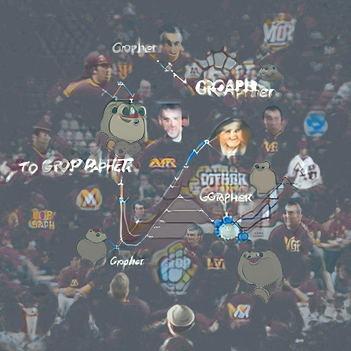

# GopherCorn - Simple GraphQL API written in Golang

[](https://golang.org/doc/go1.16)

```yaml
Author: Mitch Murphy
Date: 2021 Jun 20
```




**Run**: `go run server.go`

## Example Query/Mutation

```javascript
mutation createUser {
  createUser(input:{
    name:"Mitch"
    address:"123 Main St"
    phoneNumber:"123-456-7890"
  }) {
    id
    name
    address
    phoneNumber
  }
}

mutation createPost {
  createPost(input:{
    title:"Test Post", 
    body:"Test Body", 
    userId:"T5577006791947779410"
  }) {
    user {
      id
    }
    title
    body
  }
}

query findPosts {
    posts {
      title
      body
      user {
        name
      }
    }
}

query getUser {
  user(userId:"T5577006791947779410") {
    id
    name
    address
    phoneNumber
  }
}

query getUsers {
  users {
    id
    name
    address
    phoneNumber
  }
}
```